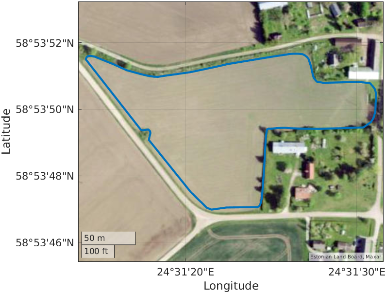
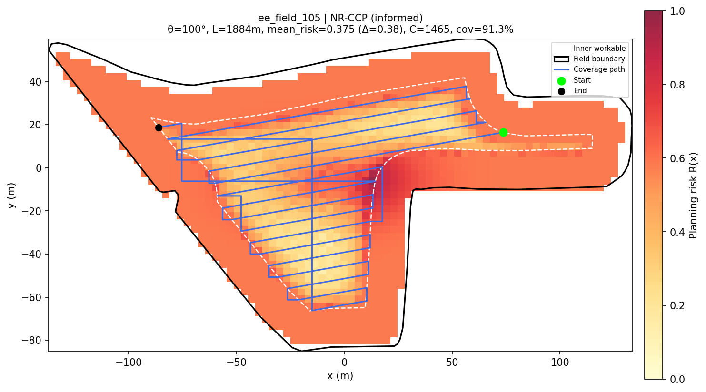
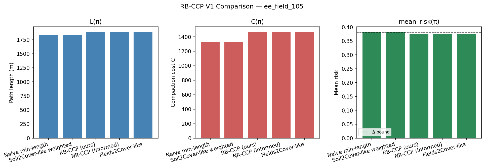

# NR-CCP

**Neural Risk-Aware Coverage Path Planning for agricultural robots.**

NR-CCP turns real field boundaries into coverage routes that know where the soil is fragile. It builds a 2D planning grid from WKT field polygons, estimates compaction risk from headlands, repeated passes, turns, vehicle load, tire pressure, and soil moisture, then compares route-selection strategies with reproducible figures and CSV metrics.

> This repository is a compact research prototype. It is designed for fast experiments, visual debugging, and paper-style comparisons, not as a production-grade replacement for NR-RRT or Fields2Cover.

## What You See

<table>
  <tr>
    <td width="33%"></td>
    <td width="33%"></td>
    <td width="33%"></td>
  </tr>
  <tr>
    <td align="center"><b>1. Real field input</b><br>WKT boundaries from field datasets.</td>
    <td align="center"><b>2. Risk-aware route</b><br>Heatmap + headland + selected coverage path.</td>
    <td align="center"><b>3. Quantified tradeoff</b><br>Length, compaction cost, and risk-bound diagnostics.</td>
  </tr>
</table>

In one run, the project answers the practical planning question:

> If a robot must cover this field, which route keeps the path short while avoiding high compaction risk?

## Core Ideas

- **Coverage first:** generate swath-based boustrophedon candidates over real 2D field polygons.
- **Risk model:** combine headland exposure, synthetic hotspots, historical/pass-count effects, repeated traversal, turn penalties, and physics-informed compaction multipliers.
- **Risk-bounded selection:** compare shortest-path, weighted-cost, RB-CCP, NR-CCP informed search, and Fields2Cover-like baselines under the same metrics.
- **Reproducible outputs:** every run writes path figures, comparison plots, and per-method CSV rows for later analysis.

## Quick Start

```bash
git clone https://github.com/zhong12350/NR_CCP.git
cd NR_CCP

python3 -m venv .venv
source .venv/bin/activate
pip install -r requirements.txt

python main.py configs/default.yaml wkt/ee_field_105.wkt
```

If Matplotlib tries to open a GUI backend on a headless machine, run:

```bash
MPLBACKEND=Agg python main.py configs/default.yaml wkt/ee_field_105.wkt
```

Outputs are written to `outputs/`:

```text
outputs/
  figures/                 # Risk heatmaps, selected paths, comparison plots
  results/                 # Per-field and batch CSV metrics
  advisor_demo/            # Demo-ready planning figures
```

## Run More Experiments

```bash
# Full default single-field run
python main.py

# Run a specific field polygon
python main.py wkt/ee_field_10.wkt

# Batch evaluation over WKT fields
python main.py batch

# Analyze batch CSVs and generate summary plots
python main.py analyze

# Risk-bound sensitivity
python main.py delta_sweep

# Component ablation
python main.py ablation

# Candidate-budget experiment
python main.py budget_experiment

# Vehicle/soil physics sensitivity
python main.py physics_sensitivity

# Train the informed sampler
python main.py train_sampler
```

The larger experiment setup lives in `configs/nr_ccp_full.yaml`. For a smaller demo run, use `configs/default.yaml`.

## Compared Methods

| Method | What it does |
| --- | --- |
| `naive` | Selects the shortest available coverage candidate. |
| `weighted` | Minimizes path length plus weighted compaction cost. |
| `rb_ccp` | Applies risk-bounded coverage-path selection over the full candidate pool. |
| `nr_ccp` | Applies the risk-bounded rule on an informed candidate pool. |
| `fields2cover` | Uses official/imported Fields2Cover records when available, with a heuristic fallback. |

## Metrics

| Metric | Meaning |
| --- | --- |
| `path_length_m` | Total route length. |
| `compaction_cost` | Accumulated risk-weighted traversal cost. |
| `mean_risk`, `max_risk` | Average and peak planning risk along the selected path. |
| `coverage_rate` | Fraction of workable area covered by the route. |
| `fallback` | Whether the configured risk bound could not be satisfied. |
| `violation` | How far the selected route exceeds the risk bound. |
| `physics_factor` | Combined multiplier from load, pressure, and soil moisture. |

## Repository Map

```text
NR_CCP/
  configs/                 # YAML experiment configurations
  docs/assets/             # README figures
  imgs/                    # Field preview images
  models/                  # Optional trained sampler weights
  notes/                   # Demo notes and presentation material
  scripts/                 # Experiment and analysis entry points
  src/                     # Planning, risk, metrics, physics, visualization
  wkt/                     # Field boundary polygons
  main.py                  # Main CLI entry point
  requirements.txt         # Python dependencies
```

## Configuration Highlights

Most behavior is controlled by YAML:

- `field.wkt_path`: default field polygon.
- `headland.width_m`: headland buffer width.
- `risk_field`: headland, hotspot, pass-count, repeat, and turn penalties.
- `vehicle`, `soil`, `physics`: compaction multipliers from wheel load, contact pressure, and moisture.
- `planner.swath_width_m`: coverage swath spacing.
- `planner.angle_step_deg`: candidate angle resolution.
- `selection.delta`: mean-risk bound.
- `methods`: methods included in a run.
- `batch.field_glob`: WKT files used for batch evaluation.

## Notes

- `outputs/` is intentionally ignored by Git because figures and CSVs are regenerated from configs.
- `models/*.npz` is ignored; retrain or share sampler weights separately when needed.
- The included README figures were generated from the lightweight default demo and are meant to show the workflow, not claim final benchmark performance.

